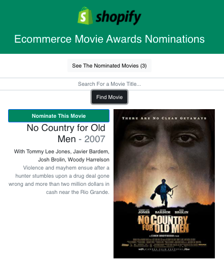

The Shopify Ecommerce Movie Awards
==============================

## Description 
This app allows users to find their favorite films on OMDB and nominate them for the Shopfiy Movie Awards. I developed the React app as a coding challenge for a frontend developer internship at Spotify. 

## Installation
As simple as cloning the repo and `npm i` then `npm start`.
You can also find a deployed link [here](
https://sheltered-ridge-37821.herokuapp.com/).

## Usage 
Users can nominate up to 5 movies which are saved to a database. Previous selections can be removed. 

## Credits
I created this React app with a Node backend connecting to Atlas MongoDB database and the OMDB api. 

## License
MIT
